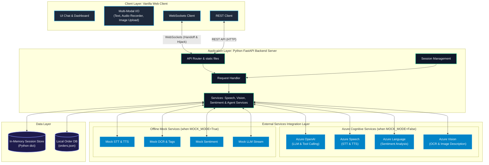

# Multi-Modal Azure Support Agent

A real-time, multi-modal customer support agent designed to handle customer requests via text, voice, and images. It features a Python FastAPI backend and an interactive glassmorphic web UI.

---

## Requirements

- **Python**: Version 3.10 or higher.
- **Dependencies**:
  - `fastapi` & `uvicorn` (Backend API & server orchestration)
  - `python-dotenv` (Environment variable configuration)
  - `openai` (Azure OpenAI integration)
  - `azure-cognitiveservices-speech` (Text-to-Speech and Speech-to-Text)
  - `azure-ai-textanalytics` (Sentiment tracking)
  - `azure-ai-vision-imageanalysis` (Image OCR and description analysis)
  - `pydantic` (Data schema validation)
  - `websockets` (Real-time agent-supervisor handoff communication)
  - `python-multipart` & `aiofiles` & `requests` (File upload and HTTP requests)
  - `pytest` & `pytest-asyncio` (Testing frameworks)
  - `streamlit` (Optional frontend UI utility)

---

## Environment Setup

Create a file named `.env` in the root directory of the project and define the following variables:

```env
# Toggle between Mock Mode (True) and Live Azure Services (False)
MOCK_MODE=False

# Azure OpenAI Configuration
AZURE_OPENAI_API_KEY=your_azure_openai_key
AZURE_OPENAI_ENDPOINT=https://your-resource-name.openai.azure.com/
AZURE_OPENAI_DEPLOYMENT_NAME=gpt-5.4-nano  # or your custom deployment name
AZURE_OPENAI_API_VERSION=2026-03-17  # or your api version

# Azure AI Speech Configuration
AZURE_SPEECH_KEY=your_azure_speech_key
AZURE_SPEECH_ENDPOINT=https://your-resource-name.cognitiveservices.azure.com/
AZURE_SPEECH_REGION=eastus           # or your resource region

# Azure AI Vision Configuration (v4.0)
AZURE_VISION_KEY=your_azure_vision_key
AZURE_VISION_ENDPOINT=https://your-resource-name.cognitiveservices.azure.com/

# Azure AI Language Configuration (Text Analytics)
AZURE_LANGUAGE_KEY=your_azure_language_key
AZURE_LANGUAGE_ENDPOINT=https://your-resource-name.cognitiveservices.azure.com/
```

*Note: Set `MOCK_MODE=True` to run the application offline. In mock mode, the system will simulate all Azure service calls locally without requiring real keys.*

---

## Backend Running Code

To start the FastAPI backend server, run the following command in the root folder:

```bash
python app.py
```

This launches a FastAPI server on `http://localhost:8000` which serves the API endpoints and the static frontend UI dashboard.

---

## Backend Features & Azure Functionality Used

- **Multi-Modal Interaction**: Handles text inputs, image uploads, and voice recordings.
- **Azure OpenAI Service**: Powers the core conversational agent, system prompts, tool calling execution, and generates structured markdown session summaries during handoff.
- **Azure AI Vision (v4.0)**: Analyzes uploaded images to detect physical objects, identify items (such as damaged shipments), and read text (OCR) such as barcodes or serial numbers.
- **Azure AI Speech**: 
  - **Speech-to-Text (STT)**: Transcribes user microphone audio recordings.
  - **Text-to-Speech (TTS)**: Synthesizes the agent's text replies into playable WAV files.
- **Azure AI Language (Text Analytics)**: Computes sentiment scores for user messages. It monitors rolling customer sentiments and automatically triggers a human agent escalation when three consecutive negative messages are detected.
- **WebSocket Session Handoff**: Keeps a persistent real-time channel open between the customer interface and the supervisor dashboard for agent escalation and direct human-in-the-loop chat replacement.

---

## Models Used

- **Azure OpenAI Models**: GPT models (e.g.`gpt-5.4-nano`) for generating intelligent conversation completions and parsing function parameters.
- **Azure Speech Synthesis Models**: Natural neural voice models for voice playback (TTS).
- **Azure Speech Recognition Models**: Audio recognition models for transcription (STT).
- **Azure Vision Analysis Models**: Multi-modal models for tag, object detection, and optical character recognition (OCR).
- **Azure Text Analytics Sentiment Models**: Sentiment detection models to evaluate text polarity and scores.

---

## Agent Tool Calls

The agent uses function/tool calling to execute backend database actions. It has access to the following two tool definitions:

### 1. Order Lookup (`lookup_order`)
Retrieves order status, items, delivery details, and tracking numbers using either an Order ID or the customer's email.
- **Parameters**: `query` (String)

### 2. Return/Refund Initiation (`initiate_return_refund`)
Checks if items can be returned (requires order to be `delivered`, within a 30-day return window from delivery date, and items to be present in order history), then initiates the refund pipeline.
- **Parameters**: `order_id` (String), `reason` (String), `items_to_return` (Array of Strings)

---

## Order JSON Example Structure

The backend queries orders from a local JSON database file (`orders.json`). Below is the expected structure of the order records:

```json
[
  {
    "order_id": "ORD-10001",
    "customer_name": "John Doe",
    "customer_email": "john.doe@example.com",
    "status": "returned",
    "order_date": "2026-06-01",
    "delivery_date": "2026-06-05",
    "tracking_number": "TRK-987654321",
    "items": [
      {
        "product_name": "Wireless Headphones",
        "quantity": 1,
        "price": 99.99
      },
      {
        "product_name": "USB-C Cable",
        "quantity": 2,
        "price": 14.99
      }
    ]
  }
]
```

---

## UI Expectations

- **Customer Chat Interface**:
  - Interactive chat bubble window.
  - Microphone recording toggle button for speech queries.
  - File upload paperclip button to attach images.
  - Audio playback button to listen to natural language voice replies.
- **Supervisor Dashboard**:
  - Real-time customer session status tracking.
  - Interactive chart or metrics representing rolling customer sentiment.
  - Raw database view showing standard customer order statuses.
  - Auto-generated markdown Handoff Summary panel displaying issue, sentiment trend, and recommended steps.
  - Interactive reply window allowing the supervisor to directly hijack the conversation and send chat messages to the customer.


---


---

## Architecture Diagram & Components

This system is built using a client-server architecture designed to process text, audio, and image inputs in real time, utilizing local and in-memory storage, and integrating with Azure Cognitive Services (or offline mocks).


